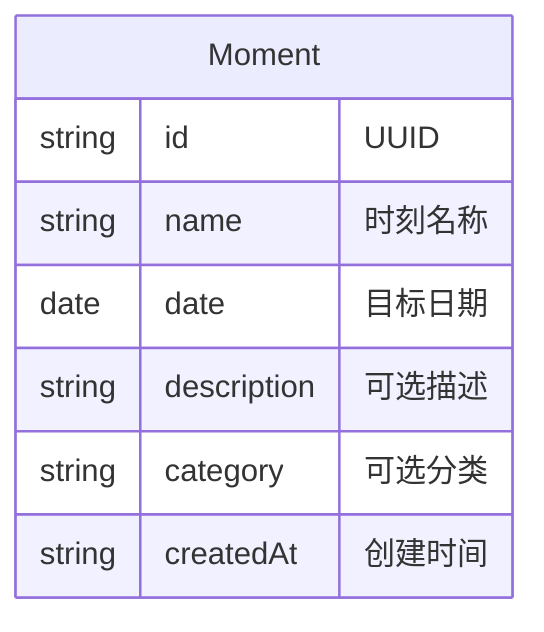
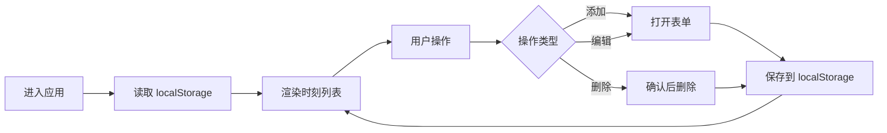

# 人生时刻流逝天数应用 - 开发文档

## 1. 项目概述

### 应用定位

记录人生中某个时刻过去的天数，支持多时刻管理。用户可添加多个重要日期（如相识日、入职日、纪念日等），应用实时计算并展示每个时刻已过去的天数。

### 目标用户

希望记录并追踪重要日期的个人用户。

### 核心价值

一目了然查看「已经过去 X 天」，让重要时刻的流逝可视化。

---

## 2. 功能需求规格

按优先级分级，便于迭代开发。

### P0 - MVP 必备

- 时刻的增删改查（名称、日期、可选描述）
- 实时计算并展示每个时刻已过去的天数
- 数据持久化（localStorage）
- 响应式布局，支持移动端

### P1 - 基础增强

- 时刻排序（按日期、名称、天数）
- 搜索与筛选
- 里程碑高亮（100 天、1 年等）

### P2 - 进阶功能

- 主题切换（明/暗）
- 数据导入/导出（JSON）
- 分享单条时刻

### P3 - 可选扩展

- 云端同步（需后端）
- 为时刻添加图片
- 周年提醒

---

## 3. 数据模型设计

### Moment 实体

| 字段 | 类型 | 必填 | 说明 |
|------|------|------|------|
| id | string | 是 | UUID，唯一标识 |
| name | string | 是 | 时刻名称 |
| date | string | 是 | 目标日期（ISO 8601） |
| description | string | 否 | 可选描述 |
| category | string | 否 | 可选分类/标签 |
| createdAt | string | 是 | 创建时间（ISO 8601） |

### 存储结构

```json
{
  "moments": [
    {
      "id": "uuid",
      "name": "相识日",
      "date": "2024-01-01",
      "description": "第一次见面的日子",
      "category": "纪念",
      "createdAt": "2024-06-01T12:00:00.000Z"
    }
  ]
}
```

- 存储于 localStorage，key 建议：`life-moments` 或 `asset-statistics-moments`

### ER 示意



---

## 4. 技术选型建议

| 类别 | 推荐方案 | 备选 |
|------|----------|------|
| 框架 | React + Vite | Vue / Svelte |
| 样式 | Tailwind CSS | CSS Modules |
| 日期计算 | date-fns / dayjs | 原生 Date |
| 状态管理 | React Context + useState | Zustand |
| 持久化 | localStorage | IndexedDB（大量数据时） |

### 依赖示例

```json
{
  "dependencies": {
    "react": "^18.x",
    "react-dom": "^18.x",
    "date-fns": "^3.x"
  },
  "devDependencies": {
    "vite": "^5.x",
    "@vitejs/plugin-react": "^4.x",
    "tailwindcss": "^3.x"
  }
}
```

---

## 5. 页面与路由结构

### MVP 路由

| 路径 | 说明 |
|------|------|
| `/` | 首页，展示所有时刻列表 |

MVP 阶段无额外路由，添加/编辑通过弹窗（Modal）或抽屉（Drawer）完成。

### 可选扩展路由

| 路径 | 说明 |
|------|------|
| `/moments/new` | 新建时刻页 |
| `/moments/:id/edit` | 编辑时刻页 |
| `/settings` | 设置页（主题、导入导出） |

---

## 6. 核心交互流程



### 天数计算规则

- 以「目标日期 0 点」为起点，计算到「当前日期 0 点」的完整天数
- 未来日期：展示为「还有 X 天」（或仅支持过去日期，根据产品决定）

---

## 7. 开发阶段规划

### Phase 1：基础骨架

- 项目初始化（Vite + React）
- 定义 Moment 数据模型与 TypeScript 类型
- 实现时刻列表展示与天数计算
- 静态 mock 数据验证 UI

### Phase 2：增删改与持久化

- 添加时刻表单（名称、日期、描述）
- 编辑时刻
- 删除时刻（含确认）
- localStorage 读写封装

### Phase 3：体验增强

- 排序（按日期、名称、天数）
- 搜索与筛选
- 响应式布局
- 里程碑高亮（100 天、1 年、5 年等）

### Phase 4：进阶功能

- 主题切换（明/暗）
- 数据导入/导出（JSON）
- 分享单条时刻（可选）

---

## 8. 目录结构建议

```
src/
├── components/       # 通用组件
│   ├── MomentCard.tsx
│   ├── MomentForm.tsx
│   └── ...
├── hooks/            # 自定义 Hooks
│   ├── useMoments.ts
│   └── useLocalStorage.ts
├── types/            # 类型定义
│   └── moment.ts
├── utils/            # 工具函数
│   └── dateUtils.ts
├── App.tsx
└── main.tsx
```

---

## 9. 里程碑高亮规则

| 天数 | 展示建议 |
|------|----------|
| 100 | 100 天 |
| 365 | 1 年 |
| 730 | 2 年 |
| 1825 | 5 年 |
| 3650 | 10 年 |

可根据需求扩展更多节点，并支持自定义文案。

---

## 10. 附录

### 相关文档

- [README.md](../README.md) - 项目简介与快速开始

### 版本记录

| 版本 | 日期 | 说明 |
|------|------|------|
| 0.1 | - | 初始文档 |
